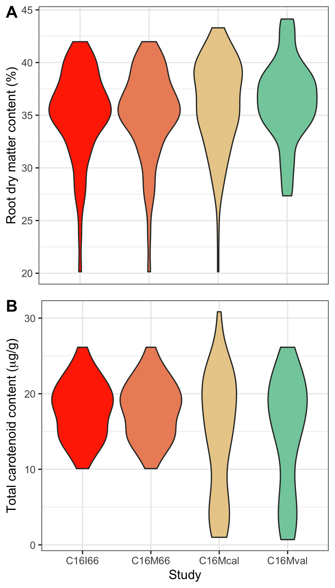

# waves

<!-- badges: start -->


<!-- badges: end -->

\code{waves} enables streamlined filtering, preprocessing, model training, and trait prediction for vis-NIRS data within a cross-validation framework that is tailored to plant breeding use cases.

## Installation
``` r
install.packages(devtools)
library(devtools)
install_github("GoreLab/waves", auth_token = github_pat())
library(waves)
```

## Examples

The package comes with an example dataset from Ikeogu et al. (2017) that can be used to try out package capabilities:

``` r
# Load and preview the example dataset (ikeogu.2017)
data(ikeogu.2017)
ikeogu.2017[1:10,1:10]

# Inspect and show the number of observations for each study within the `data.frame`
ikeogu.2017 %>% 
  group_by(study.name) %>% 
  nest() %>% 
  mutate(n.obs = map_dbl(data, ~nrow(.)))
  
# Plot reference value distributions
ikeogu.2017 %>% dplyr::select(-starts_with("X")) %>% 
  group_by(study.name) %>%
  gather(trait, value, c(DMC.oven:TCC), na.rm = T) %>%
  ggplot(aes(x= study.name, y = value, fill = study.name)) +
  facet_wrap(~ trait, scales='free_y', nrow=2) +
  geom_boxplot() +
  theme_bw()
```

## Example dataset reference distributions:


A. Root dry matter content as measured by the oven method for the four studies included in the example dataset

B. Total carotenoid content as measured by HPLC

## Performance tests
```{r}
# Subset two of the studies from the dataset in preparation for model building
C16Mcal <- ikeogu.2017 %>% filter(study.name == "C16Mcal") %>% 
  rename(reference = DMC.oven) %>%
  rename(unique.id = sample.id) %>%
  dplyr::select(unique.id, reference, starts_with("X")) %>% 
  na.omit()
C16Mval <- ikeogu.2017 %>% filter(study.name == "C16Mcal") %>% 
  rename(reference = DMC.oven) %>%
  rename(unique.id = sample.id) %>%
  dplyr::select(unique.id, reference, starts_with("X")) %>% 
  na.omit()
  
# Then try out `TestModelPerformance()` to predict reference values from spectra
test_results <- TestModelPerformance(train.data = C16Mcal, 
                                     test.data = C16Mval,
                                     num.iterations = 10, 
                                     preprocessing = T, 
                                     summary = F,
                                     wavelengths = 350:2500)
```


Root dry matter content prediction model RMSE of prediction distributions for models trained on samples from the C16Mcal study and tested on samples from C16Mval using PLSR


