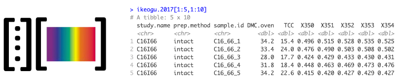

# waves

<!-- badges: start -->


<!-- badges: end -->

`waves` enables streamlined filtering, preprocessing, model training, and trait prediction for visible and near-infrared (vis-NIR) spectral data within a cross-validation framework that is tailored to plant breeding use cases.

## Testing

Follow the installation instructions below, and then go wild! Use `waves` to analyze your own data. Please report any bugs or feature requests by opening issues in this repository.

## Installation

First, create a GitHub authorization token and add it to your `.Renviron` file. [This tutorial](https://usethis.r-lib.org/articles/articles/usethis-setup.html#get-and-store-a-github-personal-access-token) gives comprehensive instructions if needed.

``` r
install.packages(devtools)
library(devtools)
install_github("GoreLab/waves", auth_token = github_pat())
library(waves)
```

## Overview
1. Format your data. Match spectra with reference values so that you have a dataframe with unique identifiers, reference values, and other metadata as columns to the left of spectral values. Spectral column names should start with "X".


2. Visualize and filter spectra using `PlotSpectra()` and `FilterSpectra()`.


3. If you have more than one scan per unique identifier, aggregate the scans by mean or median with `AggregateSpectra()`.


4. Use `TestModelPerformance()` to perform preprocessing, cross-validation set formation, and model training functions over multiple iterations.

  a. Applies any of 12 combinations of spectral preprocessing methods using `DoPreprocessing()`.


  b. Determines cross-validation scheme with `FormatCV()`. Choose from random, stratified random, or a plant breeding-specific scheme from [Jarqu&iacute;n et *al.*, 2017. *The Plant Genome*](https://doi.org/10.3835/plantgenome2016.12.0130).


  c. Trains spectral prediction models using `TrainSpectralModel()`.
   - Choose from partial least squares regression, random forest, and support vector machine algorithms
   - Uses 5-fold cross validation within the training set to tune model hyperparameters
   - Outputs model performance statistics (RMSE, R<sup>2</sup>, Bias, etc.) as assessed with test set

5. Save trained prediction models with `SaveModel()`.
  - Intended for a production environment
  - Can evaluate preprocessing methods using the input dataset
  - Selects best model using the metric provided (RMSE or  R<sup>2</sup>)
  - Returns trained model with option to save as .Rds object

6. Predict phenotypic values with new spectra and a saved model using `PredictFromSavedModel()`.


## Examples

The package comes with an example dataset from [Ikeogu et *al.* (2017) *PLoS ONE*](https://doi.org/10.1371/journal.pone.0188918) that can be used to try out package capabilities:

``` r
# Load and preview the example dataset (ikeogu.2017)
data(ikeogu.2017)
ikeogu.2017[1:10,1:10]

# Inspect and show the number of observations for each study within the `data.frame`
ikeogu.2017 %>% 
  group_by(study.name) %>% 
  nest() %>% 
  mutate(n.obs = map_dbl(data, ~nrow(.)))
  
# Plot reference value distributions
ikeogu.2017 %>% dplyr::select(-starts_with("X")) %>% 
  group_by(study.name) %>%
  gather(trait, value, c(DMC.oven:TCC), na.rm = T) %>%
  ggplot(aes(x= study.name, y = value, fill = study.name)) +
  facet_wrap(~ trait, scales='free_y', nrow=2) +
  geom_boxplot() +
  theme_bw()
```

## Example dataset reference distributions:


A. Root dry matter content as measured by the oven method for the four studies included in the example dataset

B. Total carotenoid content as measured by HPLC

## Performance tests
```{r}
# Subset two of the studies from the dataset in preparation for model building
C16Mcal <- ikeogu.2017 %>% filter(study.name == "C16Mcal") %>% 
  rename(reference = DMC.oven) %>%
  rename(unique.id = sample.id) %>%
  dplyr::select(unique.id, reference, starts_with("X")) %>% 
  na.omit()
C16Mval <- ikeogu.2017 %>% filter(study.name == "C16Mcal") %>% 
  rename(reference = DMC.oven) %>%
  rename(unique.id = sample.id) %>%
  dplyr::select(unique.id, reference, starts_with("X")) %>% 
  na.omit()
  
# Then try out `TestModelPerformance()` to predict reference values from spectra
test_results <- TestModelPerformance(train.data = C16Mcal, 
                                     test.data = C16Mval,
                                     num.iterations = 10, 
                                     preprocessing = T, 
                                     summary = F,
                                     wavelengths = 350:2500)
```


Root dry matter content prediction model RMSE of prediction distributions for models trained on samples from the C16Mcal study and tested on samples from C16Mval using PLSR


