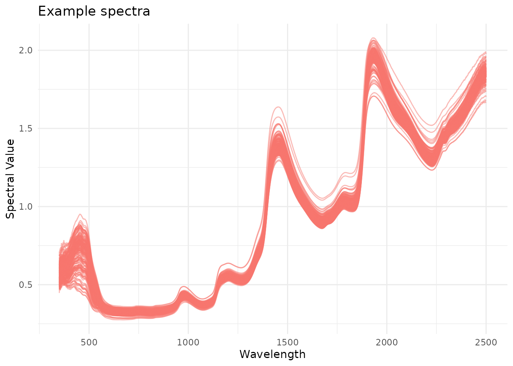
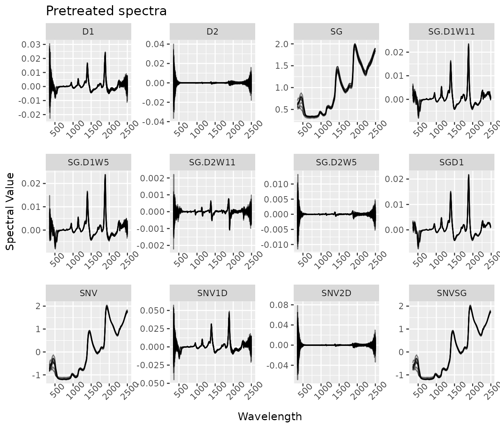
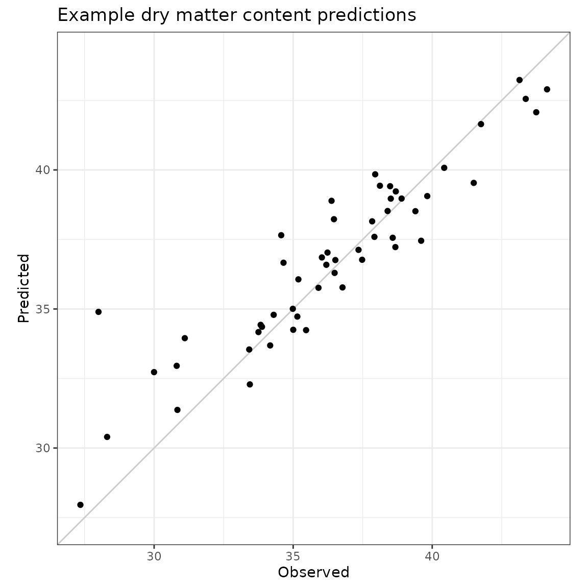

# waves

``` r
library(waves)
library(magrittr)
library(dplyr)
library(tidyr)
library(ggplot2)
library(tibble)
```

## Introduction

Originally designed application in the context of resource-limited plant
research and breeding programs, `waves` provides an open-source solution
to spectral data processing and model development by bringing useful
packages together into a streamlined pipeline. This package is wrapper
for functions related to the analysis of point visible and near-infrared
reflectance measurements. It includes visualization, filtering,
aggregation, pretreatment, cross-validation set formation, model
training, and prediction functions to enable open-source association of
spectral and reference data.

## Use

Follow the installation instructions below, and then go wild! Use
`waves` to analyze your own data. Please report any bugs or feature
requests by opening issues in the [`waves`
repository](https://github.com/GoreLab/waves).

## Installation

Install the latest `waves` release directly from CRAN:

``` r
install.packages("waves")
library(waves)
```

Alternatively, install the development version to get the most
up-to-date (but not necessarily thoroughly tested) version:

``` r
install.packages("devtools")
devtools::install_github("GoreLab/waves")
library(waves)
```

## 1. Format your data

Match spectra with reference values so that you have a `data.frame` with
unique identifiers, reference values, and other metadata as columns to
the left of spectral values. Spectral column names should start with
“X”. Remove rows with missing values.

``` r
ikeogu.2017[1:7, 1:7]
#> # A tibble: 7 × 7
#>   study.name sample.id DMC.oven   TCC  X350  X351  X352
#>   <chr>      <chr>        <dbl> <dbl> <dbl> <dbl> <dbl>
#> 1 C16Mcal    C16Mcal_1     39.6  1.00 0.488 0.495 0.506
#> 2 C16Mcal    C16Mcal_2     35.5 17.0  0.573 0.568 0.599
#> 3 C16Mcal    C16Mcal_3     42.0 21.6  0.599 0.627 0.624
#> 4 C16Mcal    C16Mcal_4     39.0  2.43 0.517 0.516 0.514
#> 5 C16Mcal    C16Mcal_5     33.4 24.0  0.519 0.548 0.554
#> 6 C16Mcal    C16Mcal_6     32.1 19.0  0.576 0.566 0.589
#> 7 C16Mcal    C16Mcal_7     35.8  6.61 0.530 0.536 0.525

ikeogu.2017.prepped <- ikeogu.2017 %>%
  dplyr::rename(unique.id = sample.id,
                reference = DMC.oven) %>%
  dplyr::select(unique.id, dplyr::everything(), -TCC) %>%
  na.omit()

ikeogu.2017.prepped[1:7, 1:7]
#> # A tibble: 7 × 7
#>   unique.id study.name reference  X350  X351  X352  X353
#>   <chr>     <chr>          <dbl> <dbl> <dbl> <dbl> <dbl>
#> 1 C16Mcal_1 C16Mcal         39.6 0.488 0.495 0.506 0.494
#> 2 C16Mcal_2 C16Mcal         35.5 0.573 0.568 0.599 0.593
#> 3 C16Mcal_3 C16Mcal         42.0 0.599 0.627 0.624 0.606
#> 4 C16Mcal_4 C16Mcal         39.0 0.517 0.516 0.514 0.536
#> 5 C16Mcal_5 C16Mcal         33.4 0.519 0.548 0.554 0.549
#> 6 C16Mcal_6 C16Mcal         32.1 0.576 0.566 0.589 0.591
#> 7 C16Mcal_7 C16Mcal         35.8 0.530 0.536 0.525 0.539
```

## 2. Visualize spectra with `plot_spectra()`

To display outliers in a different color, set `detect.outliers` to
`TRUE`.

``` r
ikeogu.2017.prepped %>%
  plot_spectra(
    df = .,
    num.col.before.spectra = 5,
    detect.outliers = FALSE,
    alternate.title = "Example spectra"
  )
```



## 3. Perform outlier removal with `filter_spectra()`.

`waves` uses Mahalanobis distance to identify outliers. Mahalanobis
distance is a common metric used to identify multivariate outliers. The
larger the value of Mahalanobis distance, the more unusual the data
point (i.e., the more likely it is to be a multivariate outlier).

The distance tells us how far an observation is from the center of the
cloud, taking into account the shape (covariance) of the cloud as well.

To detect outliers, the calculated Mahalanobis distance is compared
against a $\chi^{2}$ distribution with degrees of freedom equal to the
number of spectral data columns and an alpha level of 0.05.

``` r
filtered.df <- ikeogu.2017.prepped %>%
  filter_spectra(
    df = .,
    filter = TRUE,
    return.distances = TRUE,
    num.col.before.spectra = 5,
    window.size = 15
    )
#> 
#> Removed 0 rows.

filtered.df[1:5, c(1:5, (ncol(filtered.df) - 3):ncol(filtered.df))]
#>   unique.id study.name reference      X350      X351    X2497    X2498    X2499
#> 1 C16Mcal_1    C16Mcal  39.62109 0.4881079 0.4951843 1.866739 1.867465 1.870405
#> 2 C16Mcal_2    C16Mcal  35.52017 0.5727389 0.5682541 1.893840 1.901451 1.891114
#> 3 C16Mcal_3    C16Mcal  42.04462 0.5989934 0.6266454 1.834644 1.828793 1.826562
#> 4 C16Mcal_4    C16Mcal  39.00999 0.5169374 0.5164186 1.837023 1.836635 1.835856
#> 5 C16Mcal_5    C16Mcal  33.44273 0.5189608 0.5477946 1.900873 1.897076 1.899430
#>      X2500
#> 1 1.870702
#> 2 1.888507
#> 3 1.832022
#> 4 1.834857
#> 5 1.896130
```

No outliers were identified in the example dataset. Note the if
`return.distances` is set to `TRUE`, the rightmost column contains
Mahalanobis distances (`h.distances`).

## 4. Aggregate scans

If you have more than one scan per unique identifier, aggregate the
scans by mean or median with
[`aggregate_spectra()`](https://GoreLab.github.io/waves/dev/reference/aggregate_spectra.md).

In this example, we will aggregate by `study.name`.

``` r
aggregated.test <- ikeogu.2017.prepped %>%
  aggregate_spectra(
    grouping.colnames = c("study.name"),
    reference.value.colname = "reference",
    agg.function = "mean"
    )
aggregated.test[, 1:5]
#> # A tibble: 2 × 5
#>   study.name reference  X350  X351  X352
#>   <chr>          <dbl> <dbl> <dbl> <dbl>
#> 1 C16Mcal         36.1 0.559 0.562 0.569
#> 2 C16Mval         36.4 0.545 0.549 0.552
```

## 5. Evaluate the predictive ability of your spectra

[`test_spectra()`](https://GoreLab.github.io/waves/dev/reference/test_spectra.md)
is a wrapper that performs spectral pretreatment
([5.1](#id_5.1.%20Pretreat%20spectra)), cross-validation set formation
([5.2](#id_5.2.%20Specify%20a%20cross-validation%20scheme)), and model
training functions over multiple iterations
([5.3](#id_5.3.%20Train%20spectral%20prediction%20models)).

Note that the following subsections describe functions that are called
within
[`test_spectra()`](https://GoreLab.github.io/waves/dev/reference/test_spectra.md).
They do not need to be used separately for model pretreatment,
cross-validation set formation, or model training.

Some of the arguments for this function are detailed below. A
description of output is below under section [5.4](#id_5.4.%20Output).
See `?test_spectra()` for more information on the arguments and output
for this function.

``` r
results.list <- ikeogu.2017.prepped %>%
  dplyr::select(unique.id, reference, dplyr::starts_with("X")) %>%
  na.omit() %>%
  test_spectra(
    train.data = .,
    tune.length = 3,
    num.iterations = 3,
    pretreatment = 1
    )
#> Warning: The `save.model` argument of `test_spectra()` is deprecated as of waves 0.2.0.
#> ℹ Models are now saved by default.
#> ℹ The deprecated feature was likely used in the waves package.
#>   Please report the issue at <https://github.com/GoreLab/waves/issues>.
#> This warning is displayed once every 8 hours.
#> Call `lifecycle::last_lifecycle_warnings()` to see where this warning was
#> generated.
#> Warning: The `return.model` argument of `test_spectra()` is deprecated as of waves
#> 0.2.0.
#> ℹ Trained models are now returned by default.
#> ℹ The deprecated feature was likely used in the waves package.
#>   Please report the issue at <https://github.com/GoreLab/waves/issues>.
#> This warning is displayed once every 8 hours.
#> Call `lifecycle::last_lifecycle_warnings()` to see where this warning was
#> generated.
#> Pretreatment initiated.
#> Training models...
#> Working on Raw_data
#> Warning: The `wavelengths` argument of `train_spectra()` is deprecated as of waves
#> 0.2.0.
#> ℹ Wavelength specification is now inferred from column names.
#> ℹ The deprecated feature was likely used in the waves package.
#>   Please report the issue at <https://github.com/GoreLab/waves/issues>.
#> This warning is displayed once every 8 hours.
#> Call `lifecycle::last_lifecycle_warnings()` to see where this warning was
#> generated.
#> Warning: The `preprocessing` argument of `train_spectra()` is deprecated as of waves
#> 0.2.0.
#> ℹ Argument `preprocessing` is deprecated. Use `pretreatment` instead:
#>   `pretreatment = 1:13` (all), or `pretreatment = 1` (raw only).
#> ℹ The deprecated feature was likely used in the waves package.
#>   Please report the issue at <https://github.com/GoreLab/waves/issues>.
#> This warning is displayed once every 8 hours.
#> Call `lifecycle::last_lifecycle_warnings()` to see where this warning was
#> generated.
#> Warning: The `save.model` argument of `train_spectra()` is deprecated as of waves 0.2.0.
#> ℹ Models are now saved by default.
#> ℹ The deprecated feature was likely used in the waves package.
#>   Please report the issue at <https://github.com/GoreLab/waves/issues>.
#> This warning is displayed once every 8 hours.
#> Call `lifecycle::last_lifecycle_warnings()` to see where this warning was
#> generated.
#> Loading required package: lattice
#> 
#> Attaching package: 'pls'
#> The following object is masked from 'package:caret':
#> 
#>     R2
#> The following object is masked from 'package:stats':
#> 
#>     loadings
#> Returning model...
```

### 5.1. Pretreat spectra

Specify which spectral pretreatments (1-13) to apply with the parameter
`pretreatment`.
[`pretreat_spectra()`](https://GoreLab.github.io/waves/dev/reference/pretreat_spectra.md)
can also be used on its own to transform a data.frame using any/all of
12 available pretreatments:

1.  Raw data (no pretreatment is applied)
2.  Standard normal variate (SNV)
3.  SNV and first derivative
4.  SNV and second derivative
5.  First derivative
6.  Second derivative
7.  Savitzky–Golay filter (SG)
8.  SNV and SG
9.  Gap segment derivative (window size = 11)
10. SG and first derivative (window size = 5)
11. SG and first derivative (window size = 11)
12. SG and second derivative (window size = 5)
13. SG and second derivative (window size = 11)

``` r
ikeogu.2017.prepped[1:10, ] %>% # subset the first 10 scans for speed
  pretreat_spectra(pretreatment = 2:13) %>% # exclude pretreatment 1 (raw data)
  bind_rows(.id = "pretreatment") %>%
  gather(key = "wl",
         value = "s.value",
         tidyselect::starts_with("X")) %>%
  mutate(wl = as.numeric(readr::parse_number(.data$wl)),
         pretreatment = as.factor(pretreatment)) %>%
  drop_na(s.value) %>%
  ggplot(data = ., aes(x = wl, y = s.value, group = unique.id)) +
  geom_line(alpha = .5) +
  theme(axis.text.x = element_text(angle = 45)) +
  labs(title = "Pretreated spectra",
       x = "Wavelength",
       y = "Spectral Value") +
  facet_wrap(~ pretreatment, scales = "free")
```

 Note that the
scales in this plot are “free”. Without free scales, anything
derivative-based treatment (D1 or D2) looks like it’s a constant zero in
comparison to those without derivative-based treatments (SNV, SG).

### 5.2. Specify a cross-validation scheme

Choose from random, stratified random, or a plant breeding-specific
scheme from [Jarquín et *al.*, 2017. *The Plant
Genome*](https://doi.org/10.3835/plantgenome2016.12.0130). Options
include:

| `cv.scheme` | Description                                                                               |
|-------------|-------------------------------------------------------------------------------------------|
| `NULL`      | Random or stratified random sampling (does not take genotype or environment into account) |
| “CV1”       | Untested lines in tested environments                                                     |
| “CV2”       | Tested lines in tested environments                                                       |
| “CV0”       | Tested lines in untested environments                                                     |
| “CV00”      | Untested lines in untested environments                                                   |

If `cv.scheme` is set to `NULL`, the argument `stratified.sampling` is
used to determine whether stratified random sampling should be
performed. If `TRUE`, the reference values from the input `data.frame`
(`train.data`) will be used to create a balanced split of data between
the training and test sets in each training iteration.

When using one of the four specialized cross-validation schemes (“CV1”,
“CV2”, “CV0”, or “CV00”), additional arguments are required: - `trial1`
contains the trial to be tested in subsequent model training functions.
The first column contains unique identifiers, second contains genotypes,
third contains reference values, followed by spectral columns. Include
no other columns to right of spectra! Column names of spectra must start
with “X”, reference column must be named “reference”, and genotype
column must be named “genotype”. -`trial2` contains a trial that has
overlapping genotypes with `trial1` but that were grown in a different
site/year (different environment). Formatting must be consistent with
`trial1`. - `trial3` contains a trial that may or may not contain
genotypes that overlap with `trial1`. Formatting must be consistent with
`trial1`.

Cross-validation schemes can also be formatted outside of
[`test_spectra()`](https://GoreLab.github.io/waves/dev/reference/test_spectra.md)
using the function
[`format_cv()`](https://GoreLab.github.io/waves/dev/reference/format_cv.md).

### 5.3. Train spectral prediction models

Many of the arguments for
[`test_spectra()`](https://GoreLab.github.io/waves/dev/reference/test_spectra.md)
are related to model training: - `model.method` is the algorithm type to
use for training. See the table below for more information -
`tune.length` is the number of PLS components to test. This argument is
ignored if other algorithms are used - `best.model.metric` indicates the
metric used to decide which model is best (“RMSE” or “R-squared”) -
`k-fold` specifies the number of folds used for cross-validation to tune
model hyperparameters within the training set - `num.iterations` sets
the number of training iterations - `proportion.train` is the fraction
of samples to be included in the training set (default is 0.7)

Models can also be trained with the standalone function
[`train_spectra()`](https://GoreLab.github.io/waves/dev/reference/train_spectra.md).
Model training is implemented with
[`caret`](https://topepo.github.io/caret/).

| Algorithm                                       | `model.method` | R package source                                                  | Tuning parameters (hyperparameters) |
|-------------------------------------------------|----------------|-------------------------------------------------------------------|-------------------------------------|
| Partial least squares (PLS)                     | “pls”          | [`pls`](https://CRAN.R-project.org/package=pls)                   | ncomp                               |
| Random forest (RF)                              | “rf”           | [`randomForest`](https://CRAN.R-project.org/package=randomForest) | mtry                                |
| Support vector machine (SVM) with linear kernel | “svmLinear”    | [`kernlab`](https://CRAN.R-project.org/package=kernlab)           | C                                   |
| Support vector machine (SVM) with radial kernel | “svmRadial     | [`kernlab`](https://CRAN.R-project.org/package=kernlab)           | sigma, C                            |

### 5.4. Output

[`test_spectra()`](https://GoreLab.github.io/waves/dev/reference/test_spectra.md)
outputs a list with four objects:

1.  `model.list` is a list of trained model objects, one for each
    pretreatment method specified by the `pretreatment` argument. Each
    model is trained with all rows of the input `data.frame` (`df`)

``` r
summary(results.list$model)
#> Data:    X dimension: 173 2151 
#>  Y dimension: 173 1
#> Fit method: kernelpls
#> Number of components considered: 3
#> TRAINING: % variance explained
#>            1 comps  2 comps  3 comps
#> X            62.65    68.38    91.17
#> reference    63.34    75.71    76.87
```

2.  `summary.model.performance` is a `data.frame` containing summary
    statistics across all model training iterations and pretreatments.
    See below for a description of the summary statistics provided.

``` r
results.list$summary.model.performance
#>   SummaryType ModelType      RMSEp        R2p       RPD      RPIQ        CCC
#> 1        mean       pls 1.95376055 0.81071964 2.2929289 2.7735699 0.89625825
#> 2          sd       pls 0.09988373 0.02828736 0.1234882 0.1134962 0.01896225
#> 3        mode       pls 1.85463762 0.83763116 2.3948734 2.8890861 0.91442160
#>          Bias       SEP     RMSEcv        R2cv       R2sp best.ncomp best.ntree
#> 1 -0.03665762 1.9740073 2.00724284 0.751925760 0.76195677          3         NA
#> 2  0.15395985 0.1009188 0.02247514 0.008214219 0.02488035          0         NA
#> 3 -0.07584944 1.8738572 2.01782789 0.750662996 0.77188776          3         NA
#>   best.mtry
#> 1        NA
#> 2        NA
#> 3        NA
```

3.  `model.performance` is a `data.frame` containing performance
    statistics for each iteration of model training separately (see
    below).

``` r
results.list$model.performance
#>   Iteration ModelType    RMSEp       R2p      RPD     RPIQ       CCC
#> 1         1       pls 1.854638 0.8376312 2.394873 2.889086 0.9144216
#> 2         2       pls 2.054388 0.7812326 2.155615 2.662208 0.8765871
#> 3         3       pls 1.952256 0.8132952 2.328298 2.769416 0.8977660
#>          Bias      SEP   RMSEcv      R2cv      R2sp best.ncomp best.ntree
#> 1 -0.07584944 1.873857 2.017828 0.7506630 0.7718878          3         NA
#> 2  0.13311031 2.075678 1.981430 0.7606982 0.7803379          3         NA
#> 3 -0.16723372 1.972487 2.022471 0.7444160 0.7336447          3         NA
#>   best.mtry
#> 1        NA
#> 2        NA
#> 3        NA
```

4.  `predictions` is a `data.frame` containing both reference and
    predicted values for each test set entry in each iteration of model
    training.

``` r
head(results.list$predictions)
#>   Iteration ModelType  unique.id reference predicted
#> 1         1       pls  C16Mcal_5  33.44273  29.65800
#> 2         1       pls C16Mcal_17  36.62819  38.96732
#> 3         1       pls C16Mcal_18  39.56322  36.66932
#> 4         1       pls C16Mcal_28  29.21000  30.11402
#> 5         1       pls C16Mcal_31  32.40875  33.56930
#> 6         1       pls C16Mcal_37  36.74377  37.08231
```

5.  `importance` is a `data.frame` containing variable importance
    results for each wavelength at each iteration of model training. If
    `model.method` is not “pls” or “rf”, this list item is `NULL`.

``` r
results.list$importance[, 1:7]
#> # A tibble: 3 × 7
#>   Iteration ModelType   X350   X351   X352   X353   X354
#>       <int> <chr>      <dbl>  <dbl>  <dbl>  <dbl>  <dbl>
#> 1         1 pls       0.0404 0.0397 0.0374 0.0369 0.0388
#> 2         2 pls       0.0277 0.0263 0.0279 0.0278 0.0283
#> 3         3 pls       0.0223 0.0225 0.0238 0.0242 0.0254
```

| Statistic\* | Description                                                                        |
|-------------|------------------------------------------------------------------------------------|
| RMSE_(p)    | Root mean squared error of prediction                                              |
| R²_(p)      | Squared Pearson’s correlation between predicted and observed test set values       |
| RPD         | Ratio of standard deviation of observed test set values to RMSE_(p)                |
| RPIQ        | Ratio of performance to interquartile difference                                   |
| CCC         | Concordance correlation coefficient                                                |
| Bias        | Average difference between the predicted and observed values                       |
| SEP         | Standard error of prediction                                                       |
| RMSE_(cv)   | Root mean squared error of cross-validation                                        |
| R²_(cv)     | Coefficient of multiple determination of cross-validation for PLS models           |
| R²_(sp)     | Squared Spearman’s rank correlation between predicted and observed test set values |
| best.ncomp  | Best number of components in a PLS model                                           |
| best.ntree  | Best number of trees in an RF model                                                |
| best.mtry   | Best number of variables to include at every decision point in an RF model         |

\*Many of the spectral model performance statistics are calculated using
the function `postResampleSpectro()` from the `spectacles` package.

## 6. Save trained prediction models with `save_model()`

- Intended for a production environment
- Can evaluate spectral pretreatment methods using the input dataset
- Selects best model using the metric provided with `best.model.metric`
  (“RMSE” or “Rsquared”)
- Returns trained model with option to save as .Rds object
- The `$model` output from
  [`test_spectra()`](https://GoreLab.github.io/waves/dev/reference/test_spectra.md)
  can also be saved and used for prediction, but
  [`save_model()`](https://GoreLab.github.io/waves/dev/reference/save_model.md)
  will take the extra step of saving an .Rds file for you if
  `write.model` is set to `TRUE`.

In the example below, we’ll use one subset of the example dataset
(“C16Mcal”) to create the model and then we’ll predict the other subset
(“C16Mval”) in section
[7](#id_7.%20Predict%20phenotypic%20values%20with%20new%20spectra).

``` r
model.to.save <- ikeogu.2017.prepped %>%
  dplyr::filter(study.name == "C16Mcal") %>%
  dplyr::select(unique.id, reference, dplyr::starts_with("X")) %>%
  na.omit() %>%
  save_model(
    df = .,
    write.model = FALSE,
    pretreatment = c(1, 2, 8),  # Raw, SNV, and SNVSG (typically best performers)
    tune.length = 3,
    num.iterations = 2,
    verbose = FALSE
    )
```

Now let’s take a look at our trained model:

``` r
summary(model.to.save$best.model)
#> Data:    X dimension: 120 2141 
#>  Y dimension: 120 1
#> Fit method: kernelpls
#> Number of components considered: 3
#> TRAINING: % variance explained
#>            1 comps  2 comps  3 comps
#> X            64.48    87.94    91.43
#> reference    33.93    64.97    87.18
```

``` r
model.to.save$best.model.stats %>%
  gather(key = "statistic", value = "value", RMSEp_mean:best.mtry_mode) %>%
  separate(statistic, into =  c("statistic", "summary_type"), sep = "_") %>%
  pivot_wider(id_cols = c(Pretreatment, summary_type),
              names_from = statistic, values_from = value)
#> # A tibble: 3 × 15
#>   Pretreatment summary_type RMSEp    R2p   RPD  RPIQ    CCC   Bias   SEP RMSEcv
#>   <chr>        <chr>        <dbl>  <dbl> <dbl> <dbl>  <dbl>  <dbl> <dbl>  <dbl>
#> 1 SNVSG        mean         1.72  0.860  2.74  3.33  0.915   0.142 1.74  1.54  
#> 2 SNVSG        sd           0.202 0.0650 0.718 0.182 0.0466  0.563 0.205 0.0300
#> 3 SNVSG        mode         1.58  0.906  3.25  3.46  0.948  -0.256 1.60  1.56  
#> # ℹ 5 more variables: R2cv <dbl>, R2sp <dbl>, best.ncomp <dbl>,
#> #   best.ntree <dbl>, best.mtry <dbl>
```

## 7. Predict phenotypic values with new spectra

If generating predictions from a saved model file in .Rds format, use
[`predict_spectra()`](https://GoreLab.github.io/waves/dev/reference/predict_spectra.md).
If the model object is already in your R environment, the function
[`stats::predict()`](https://rdrr.io/r/stats/predict.html) can be used
to generate predictions.
[`predict_spectra()`](https://GoreLab.github.io/waves/dev/reference/predict_spectra.md)
pulls the best model hyperparameters from your saved model object, but
if using [`stats::predict()`](https://rdrr.io/r/stats/predict.html),
these must be supplied separately.

Using the model we trained in section
[6](#id_6.%20Save%20trained%20prediction%20models%20with%20%60save_model()%60),
we can predict cassava root dry matter content for our held out
validation set:

First, determine which pretreatment generated the best model and
pretreat the new spectral dataset accordingly.

``` r
# Get the best pretreatment number from model stats
best.pretreatment.name <- model.to.save$best.model.stats$Pretreatment
best.pretreatment.num <- match(best.pretreatment.name, 
                               c("Raw_data", "SNV", "SNV1D", "SNV2D", "D1", "D2", "SG",
                                 "SNVSG", "SGD1", "SG.D1W5", "SG.D1W11", "SG.D2W5", "SG.D2W11"))

# Use the example validation set (C16Mval)
pretreated.val <- ikeogu.2017.prepped %>%
  dplyr::filter(study.name == "C16Mval") %>%
  pretreat_spectra(pretreatment = best.pretreatment.num)

pretreated.val.mx <- pretreated.val %>%
  dplyr::select(starts_with("X")) %>%
  as.matrix()

best.ncomp <- model.to.save$best.model.stats$best.ncomp_mode
```

#### Perform predictions!

``` r
predicted.values <- as.numeric(predict(model.to.save$best.model,
                                       newdata = pretreated.val.mx,
                                       ncomp = best.ncomp))
```

#### How did we do?

``` r
spectacles::postResampleSpectro(pred = predicted.values,
                                obs = pretreated.val$reference)
#>      RMSE  Rsquared       RPD      RPIQ       CCC      Bias        SE 
#> 1.5560069 0.8420531 2.4672707 2.7511960 0.9009541 0.1604845 1.5708972
```

#### Plot predictions

``` r
overall.range <- c(min(c(pretreated.val$reference, predicted.values)),
                   max(c(pretreated.val$reference, predicted.values)))
cbind(unique.id = pretreated.val$unique.id,
      observed = pretreated.val$reference,
      predicted = predicted.values) %>%
  as_tibble() %>%
  mutate(observed = as.numeric(observed),
         predicted = as.numeric(predicted)) %>%
  ggplot(aes(x = observed, y = predicted)) +
  geom_abline(intercept = 0,
              slope = 1,
              color = "gray80") +
  geom_point() +
  coord_fixed(xlim = overall.range,
              ylim = overall.range) +
  labs(title = "Example dry matter content predictions",
       x = "Observed",
       y = "Predicted") +
  theme_bw()
```


